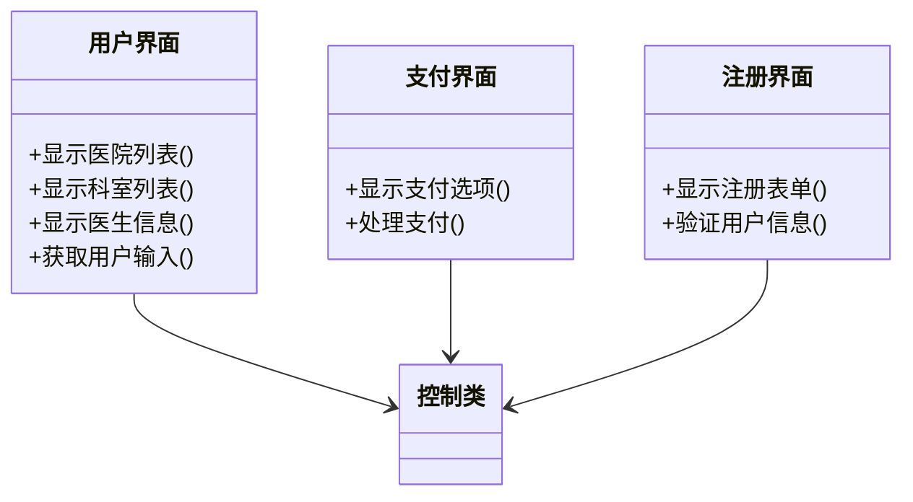
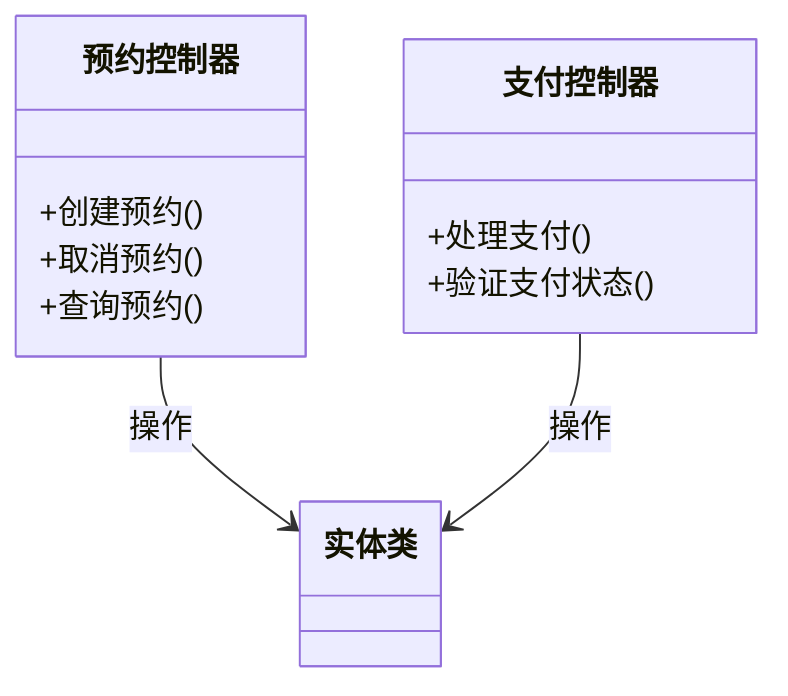
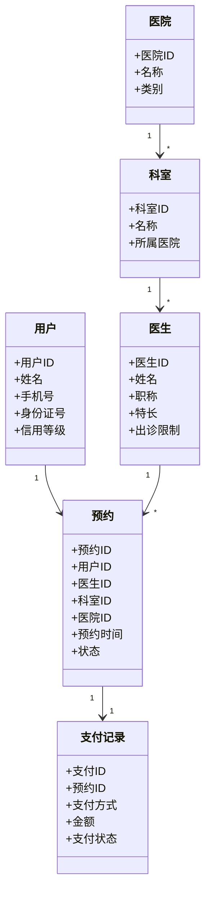
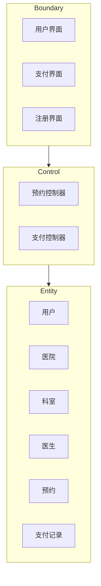
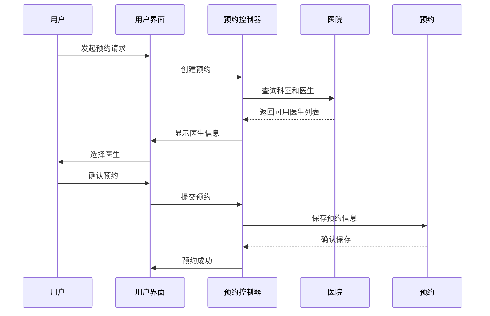
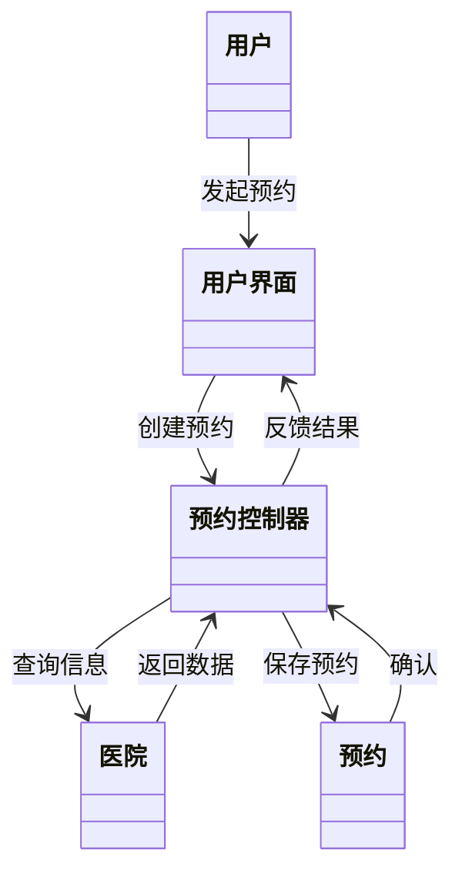
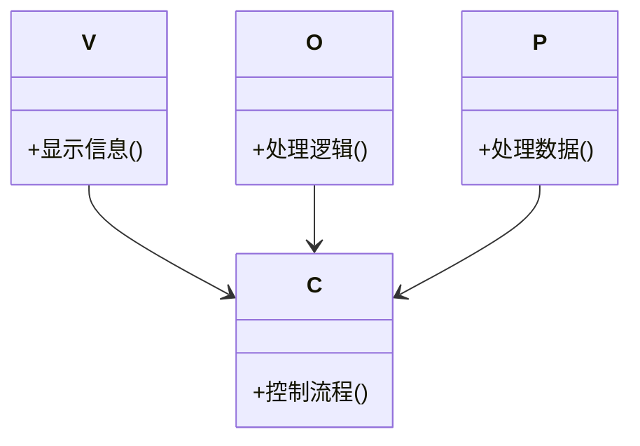
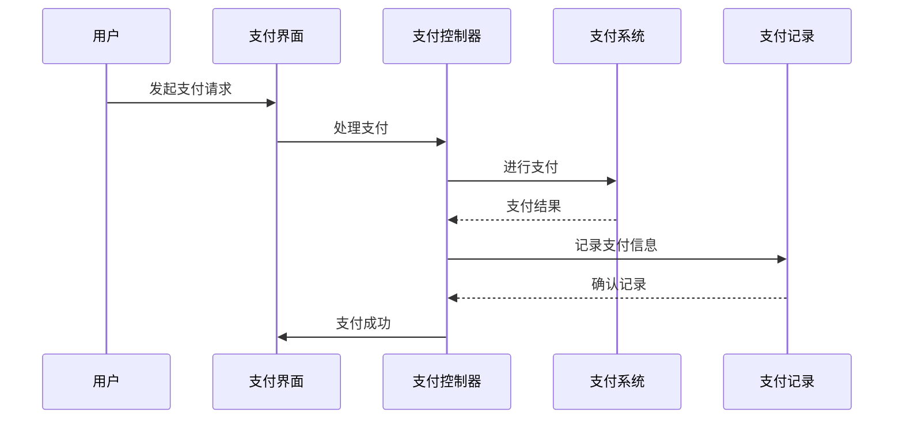
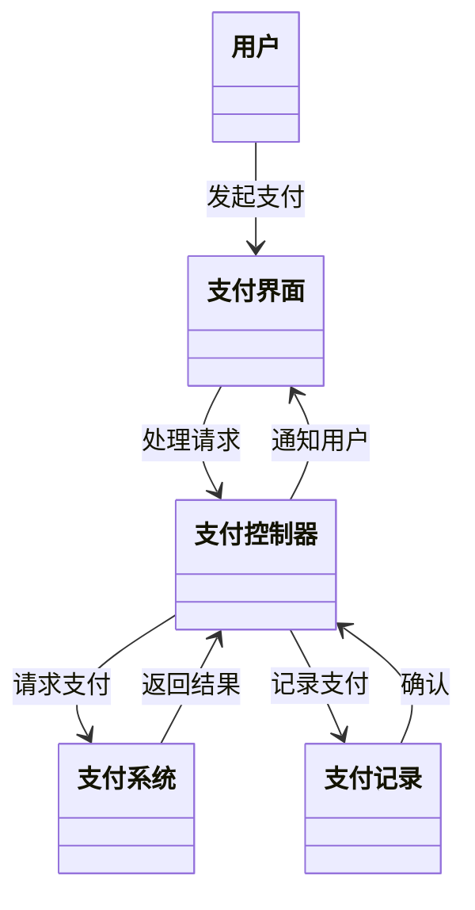
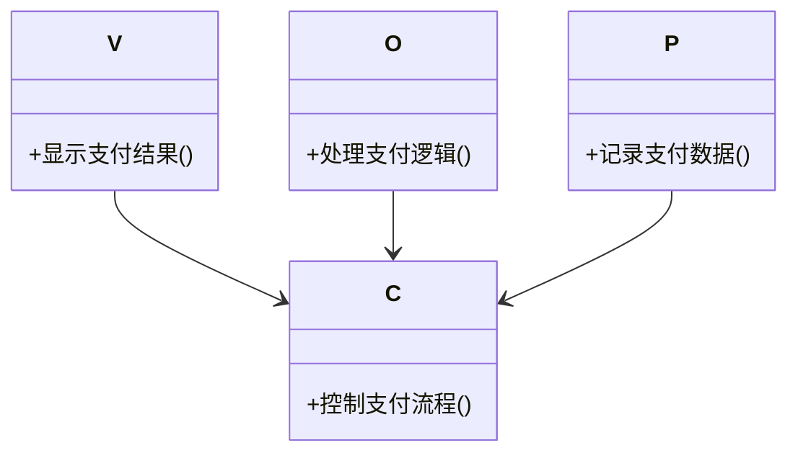

### 图2：边界类图

```mermaid
classDiagram
    class 用户界面 {
        +显示医院列表()
        +显示科室列表()
        +显示医生信息()
        +获取用户输入()
    }

    class 支付界面 {
        +显示支付选项()
        +处理支付()
    }

    class 注册界面 {
        +显示注册表单()
        +验证用户信息()
    }

    用户界面 --> 控制类
    支付界面 --> 控制类
    注册界面 --> 控制类
```

### 图3：控制类图

```mermaid
classDiagram
    class 预约控制器 {
        +创建预约()
        +取消预约()
        +查询预约()
    }

    class 支付控制器 {
        +处理支付()
        +验证支付状态()
    }

    预约控制器 --> 实体类: 操作
    支付控制器 --> 实体类: 操作
```

### 图4：实体类图

```mermaid
classDiagram
    class 用户 {
        +用户ID
        +姓名
        +手机号
        +身份证号
        +信用等级
    }

    class 医院 {
        +医院ID
        +名称
        +类别
    }

    class 科室 {
        +科室ID
        +名称
        +所属医院
    }

    class 医生 {
        +医生ID
        +姓名
        +职称
        +特长
        +出诊限制
    }

    class 预约 {
        +预约ID
        +用户ID
        +医生ID
        +科室ID
        +医院ID
        +预约时间
        +状态
    }

    class 支付记录 {
        +支付ID
        +预约ID
        +支付方式
        +金额
        +支付状态
    }

    用户 "1" --> "*" 预约
    医院 "1" --> "*" 科室
    科室 "1" --> "*" 医生
    医生 "1" --> "*" 预约
    预约 "1" --> "1" 支付记录
```

### 图5：B-C-E包图

```mermaid
graph TB
    subgraph Boundary
        用户界面
        支付界面
        注册界面
    end

    subgraph Control
        预约控制器
        支付控制器
    end

    subgraph Entity
        用户
        医院
        科室
        医生
        预约
        支付记录
    end

    Boundary --> Control
    Control --> Entity
```

### 图6：预约挂号顺序图

```mermaid
sequenceDiagram
    participant 用户
    participant 用户界面
    participant 预约控制器
    participant 医院
    participant 预约

    用户 ->> 用户界面: 发起预约请求
    用户界面 ->> 预约控制器: 创建预约
    预约控制器 ->> 医院: 查询科室和医生
    医院 -->> 预约控制器: 返回可用医生列表
    预约控制器 ->> 用户界面: 显示医生信息
    用户界面 ->> 用户: 选择医生
    用户 ->> 用户界面: 确认预约
    用户界面 ->> 预约控制器: 提交预约
    预约控制器 ->> 预约: 保存预约信息
    预约 -->> 预约控制器: 确认保存
    预约控制器 ->> 用户界面: 预约成功
```

### 图7：预约挂号协作图

```mermaid
classDiagram
    class 用户 {
    }

    class 用户界面 {
    }

    class 预约控制器 {
    }

    class 医院 {
    }

    class 预约 {
    }

    用户 --> 用户界面: 发起预约
    用户界面 --> 预约控制器: 创建预约
    预约控制器 --> 医院: 查询信息
    医院 --> 预约控制器: 返回数据
    预约控制器 --> 预约: 保存预约
    预约 --> 预约控制器: 确认
    预约控制器 --> 用户界面: 反馈结果
```

### 图8：预约挂号VOPC图

```mermaid
classDiagram
    class V {
        +显示信息()
    }

    class O {
        +处理逻辑()
    }

    class P {
        +处理数据()
    }

    class C {
        +控制流程()
    }

    V --> C
    O --> C
    P --> C
```

### 图9：支付挂号费顺序图

```mermaid
sequenceDiagram
    participant 用户
    participant 支付界面
    participant 支付控制器
    participant 支付系统
    participant 支付记录

    用户 ->> 支付界面: 发起支付请求
    支付界面 ->> 支付控制器: 处理支付
    支付控制器 ->> 支付系统: 进行支付
    支付系统 -->> 支付控制器: 支付结果
    支付控制器 ->> 支付记录: 记录支付信息
    支付记录 -->> 支付控制器: 确认记录
    支付控制器 ->> 支付界面: 支付成功
```

### 图10：支付挂号费协作图

```mermaid
classDiagram
    class 用户 {
    }

    class 支付界面 {
    }

    class 支付控制器 {
    }

    class 支付系统 {
    }

    class 支付记录 {
    }

    用户 --> 支付界面: 发起支付
    支付界面 --> 支付控制器: 处理请求
    支付控制器 --> 支付系统: 请求支付
    支付系统 --> 支付控制器: 返回结果
    支付控制器 --> 支付记录: 记录支付
    支付记录 --> 支付控制器: 确认
    支付控制器 --> 支付界面: 通知用户
```

### 图11：支付挂号费VOPC图

```mermaid
classDiagram
    class V {
        +显示支付结果()
    }

    class O {
        +处理支付逻辑()
    }

    class P {
        +记录支付数据()
    }

    class C {
        +控制支付流程()
    }

    V --> C
    O --> C
    P --> C
```